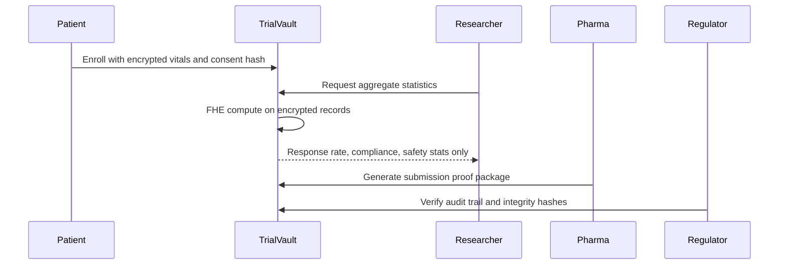

# TrialVault: FHE-Protected Clinical Trial Data Vault

TrialVault is a confidential clinical trials platform for patients, researchers, pharma sponsors, and regulators. It uses Fhenix-style fully homomorphic encryption (FHE) to let trial teams compute aggregate outcomes over encrypted patient records while preserving patient privacy and maintaining an immutable audit trail.

## Problem

Clinical trial infrastructure has three structural failures:

- Patient data is concentrated in centralized databases that expose medical history, diagnoses, genetics, vitals, treatment response, and consent records.
- Trial integrity is still proven with server logs, spreadsheets, emails, and manual audits that are hard to independently verify.
- Patients, researchers, pharma sponsors, and regulators need different levels of access, but current systems rely on brittle manual anonymization and policy controls.

## Solution

TrialVault stores trial commitments, encrypted medical values, access grants, and audit events on-chain. Researchers can compute statistics like response rate, adverse event severity, and compliance over encrypted records without seeing individual patient data. Pharma sponsors can package trial data with blockchain integrity proofs. FDA-style auditors can verify enrollment, access history, and data integrity without unnecessary PII exposure.

## Demo Flows

- **Patient Portal:** enroll in a trial with encrypted baseline vitals, view personal results, and approve data access.
- **Researcher Analytics:** run aggregate analysis over encrypted records and receive only population-level statistics.
- **Pharma Submission:** generate a regulator-ready package with hashes, signatures, FHE computation receipts, and access logs.
- **FDA Audit:** verify immutable records, consent coverage, audit completeness, and 21 CFR Part 11-style controls without viewing patient identities.

## Architecture



## Repository

```text
trialVault/
├── contracts/          # Hardhat + Fhenix Solidity contracts
├── web/                # React/Vite stakeholder demo
├── backend/            # Express/Mongo API scaffold
├── docs/               # Use cases, privacy model, FHE plan, compliance, threat model
└── README.md
```

## Smart Contracts

- `contracts/src/ClinicalTrialVault.sol`: clinical-trial-specific evidence layer with encrypted patient enrollment, encrypted outcome aggregation, patient access grants, regulator audit grants, and sealed patient self-results.
- `contracts/src/TrialVault.sol`: earlier multipurpose FHE prototype kept for continuity and comparison.

The current local package uses the installed Fhenix Solidity library. The production migration target is the current CoFHE stack documented by Fhenix: `@cofhe/sdk`, `cofhe-contracts`, and supported Sepolia networks.

## Buildathon Alignment

TrialVault targets the **RWA & Compliance** and **Privacy-Preserving AI / encrypted datasets** tracks:

- encrypted patient state by default
- aggregate computation over ciphertext
- selective disclosure for patient, researcher, sponsor, and regulator roles
- audit evidence suitable for regulated workflows
- public progress artifacts for rolling evaluation

## Run Locally

```bash
cd web
npm install
npm run dev
```

```bash
cd contracts
npm install
npm run compile
npm run test
```

## Demo Artifacts

Generate local review artifacts without deploying:

```bash
node scripts/generate-demo-artifacts.mjs
```

This writes:

- `artifacts/demo/synthetic-cohort.json`: 50 synthetic patient records with ciphertext commitments.
- `artifacts/demo/aggregate-stats.json`: local aggregate response, severity, and compliance values.
- `artifacts/demo/fda-evidence-package.json`: reviewer-facing package with protocol hash, dataset root, access log root, and aggregate receipt.

## Why FHE

Standard encryption protects data at rest and in transit, but it does not let researchers compute trial statistics without decrypting records. TrialVault’s core thesis is that clinical trials need encrypted computation: aggregate analytics for researchers, verifiable data integrity for sponsors and regulators, and patient-controlled disclosure for individuals.

## Compliance Targets

TrialVault is designed around HIPAA safeguards and FDA electronic record expectations, especially access controls, audit trails, record integrity, and electronic signature evidence. It is a prototype, not a certified regulated system, but the architecture maps directly to the controls sponsors must eventually validate.

## Current Verification

```bash
cd web && npx tsc --noEmit && npm run build
cd contracts && npm run compile
cd contracts && npm run test
```
