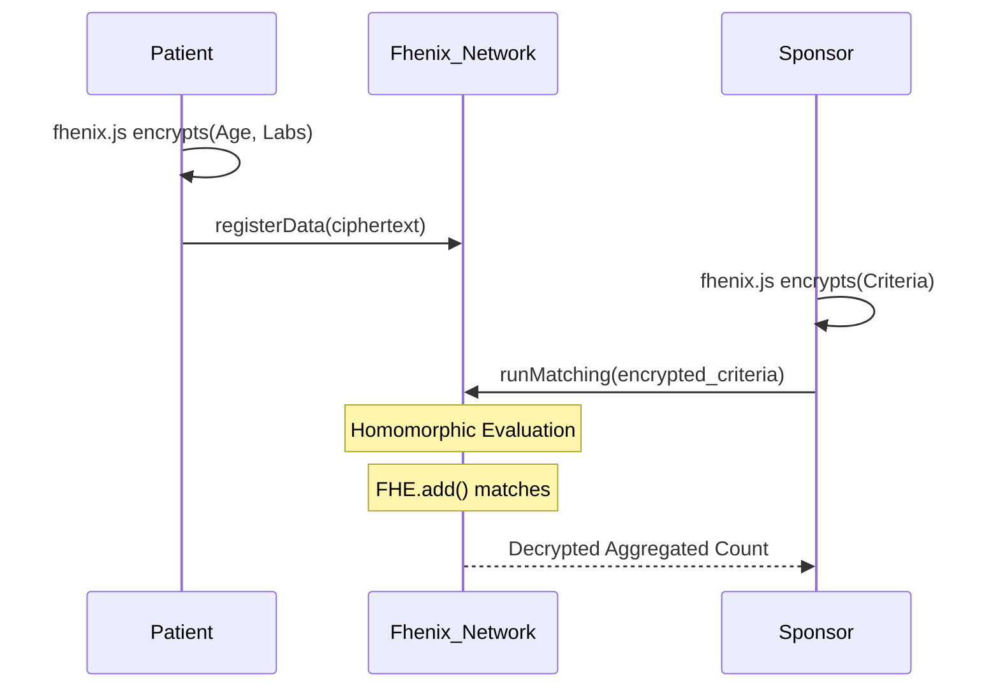

# TrialVault: FHE-Native Clinical Trial Matching & Oversight 🛡️🧬

TrialVault solves the biggest bottleneck in clinical research: **Privacy-preserving patient discovery.** 

By leveraging **Fully Homomorphic Encryption (FHE)** via the Fhenix network, TrialVault allows pharmaceutical sponsors to query global patient databases and match trial criteria *without ever decrypting* the underlying patient health records.


## The Problem: Data Silos vs. Data Privacy
- **Sponsors** spend billions and years searching for eligible trial participants.
- **Patients** are understandably unwilling to share sensitive diagnosis and lab results with central brokers.
- **Regulators** need oversight over trial safety but shouldn't have access to PII.

*Zero-Knowledge Proofs (ZKPs) alone cannot solve this*, because ZKPs are best for proving *known* data. Trial matching requires multi-party logical comparisons (`if patient.age > minAge`) on an aggregated, shared state.

## The Solution: TrialVault on Fhenix
TrialVault uses Fhenix's `euint32` compute capabilities to perform blind logical evaluations.
1. **Patient Data Vault**: Patients encrypt their records locally (using `fhenix.js`) and store the ciphertext on IPFS. The hash is minted as an ERC-721 Data NFT.
2. **Blind Matching Engine**: Sponsors submit encrypted trial criteria. The Fhenix network evaluates `FHE.gte()` and `FHE.eq()` against the encrypted patient pool and returns *only* the aggregated pool count.
3. **Regulator Oversight**: Adverse events are submitted as encrypted severities. The contract homomorphically compares the cumulative severity against a threshold to trigger safety pauses automatically.

## 🚀 Live Demo & Deployment

**Contract Address (Fhenix Helium Testnet):** `[DEPLOY CONTRACT AND PASTE ADDRESS HERE]`

### Running the Full Stack Locally

Our stack is fully integrated: **MERN + Hardhat/Fhenix + Framer Motion UI**.

```bash
# 1. Start the Backend API
cd backend
npm install
npm run dev

# 2. Start the Frontend Application
cd web
npm install
npm run dev
```

### Try it yourself!
1. **Patient Portal (`/`)**: Connect your wallet, input mock lab values, and watch as `fhenix.js` simulates ciphertext generation before issuing your vault NFT.
2. **Sponsor Dashboard (`/pharma`)**: Run a "Blind Match" to see the custom-built **FHE Compute Visualizer** that animates the homomorphic evaluation process.
3. **Regulator Dashboard (`/regulator`)**: Monitor the encrypted adverse event telemetry.

## Architecture



## Why Fhenix?
We built on Fhenix because its native EVM coprocessor architecture allows us to write privacy-preserving logic using standard Solidity. The ability to use `FHE.select()` and `FHE.add()` drastically simplified the complex logic required for multi-hospital data aggregation.

---
*Built for the Akindo / Fhenix Wave Hack* 🌊
